# Knowledge AI

> AI-powered knowledge management system that transforms team conversations into structured documentation

[](LICENSE)
[](https://nodejs.org/)
[](https://www.typescriptlang.org/)

## 🎯 What is Knowledge AI?

Knowledge AI automatically captures important conversations from **Slack** and **Jira**, processes them with advanced AI, and generates **structured documentation** directly in your GitHub repository.

### ✨ Key Benefits

- 🧠 **AI-Powered**: Uses GPT-4 to extract key insights, decisions, and action items
- 🔄 **Automated Workflow**: From conversation to documentation with zero manual effort  
- 📝 **Structured Output**: Consistent markdown documents organized by topic
- 🔗 **Code Integration**: Links discussions to actual code with smart GitHub integration
- 👥 **Team Collaboration**: Creates GitHub PRs for review and approval

### 🚀 How It Works

```mermaid
graph LR
    A[Slack Reactions 📝] --> B[AI Processing]
    C[Jira Updates] --> B
    B --> D[Generate Docs]
    D --> E[GitHub PR]
    E --> F[Team Review]
```



1. **Capture**: Team marks important messages with reactions (📝,📋,🔖) or keywords
2. **Process**: AI extracts key information, decisions, and action items
3. **Generate**: Creates structured markdown documentation
4. **Review**: Automatically creates GitHub PRs for team approval
5. **Organize**: Documents are grouped by topic, not chronologically

## 🏗️ Architecture Overview

Knowledge AI is built with modern, scalable technologies:

- **Backend**: NestJS + TypeScript
- **Database**: PostgreSQL + Redis
- **AI**: OpenAI GPT-4 / Local Ollama
- **Integrations**: Slack, Jira, GitHub APIs
- **Queue**: Bull for async processing

> 📚 For detailed architecture information, see [docs/project-structure.md](./docs/project-structure.md)

## 📋 Prerequisites

- **Node.js** 20+ 
- **PostgreSQL** 12+
- **Redis** 6+
- **API Keys**: Slack Bot Token, GitHub Token, OpenAI API Key (or local Ollama)
- **Access**: Jira instance (if using Jira integration)

## 🚀 Quick Start

### 1. Installation

```bash
# Clone repository
git clone <your-repo-url>
cd knowledge-ai

# Install dependencies (includes development tools)
make install
```

### 2. Configuration

```bash
# Copy environment template
cp env.template .env

# Edit configuration
nano .env
```

Required environment variables:
- `SLACK_BOT_TOKEN` - Your Slack bot token
- `GITHUB_TOKEN` - GitHub personal access token  
- `OPENAI_API_KEY` - OpenAI API key (or setup Ollama for local AI)
- Database and Redis connection strings

> 🔧 For complete configuration guide, see [docs/configuration.md](./docs/configuration.md)

### 3. Development Setup

```bash
# Start development environment with webhook tunneling
make dev
```

This command:
- 🚇 Creates secure tunnel for webhook testing  
- 📋 Displays webhook URLs for Slack/Jira setup
- 🔥 Starts server with live reload
- 📊 Shows real-time logs

**Example output:**
```
🚀 Starting development environment...
✅ Tunnel ready!
━━━━━━━━━━━━━━━━━━━━━━━━━━━━━━━━━━━━━━━━━━━━━━━━━━━
📋 SLACK CONFIGURATION  
🌐 Tunnel URL: https://abc123.loca.lt
📝 Event Subscription URL: https://abc123.loca.lt/slack/events
━━━━━━━━━━━━━━━━━━━━━━━━━━━━━━━━━━━━━━━━━━━━━━━━━━━
```

### 4. Configure Integrations

#### Slack Setup
1. Create Slack app at [api.slack.com/apps](https://api.slack.com/apps)
2. Enable Event Subscriptions with the tunnel URL from `make dev`
3. Add bot scopes: `channels:history`, `channels:read`, `reactions:read`, `users:read`
4. Install app to workspace

#### GitHub Setup  
1. Create repository for documentation
2. Generate Personal Access Token with repository permissions
3. Add team members as collaborators for PR reviews

> 📖 For detailed setup instructions, see [docs/configuration.md](./docs/configuration.md)

## 🎮 Usage

### Automatic Processing

Knowledge AI automatically processes:
- **Slack messages** with reactions: 📝 📋 🔖
- **Slack messages** with keywords: "decision", "action item", "todo"
- **Jira issues** when created, updated, or commented

### Manual Collection

```bash
# Collect Slack messages with specific reactions
curl -X POST http://localhost:3000/slack/collect \
  -H "Content-Type: application/json" \
  -d '{
    "channelId": "C1234567890",
    "reactionName": "memo",
    "hours": 24
  }'
```

### Code Tracking

Link discussions to code with GitHub links:
```markdown
Check this function: [getUserById](github://myorg/api/src/user.service.ts#getUserById)
```

Knowledge AI automatically:
- Extracts code snippets from GitHub
- Embeds them in documentation  
- Tracks changes for updates

> 🔗 For complete feature documentation, see [docs/features.md](./docs/features.md)

## 🧪 Testing

```bash
# Unit tests
pnpm test

# Watch mode for development  
pnpm test:watch

# E2E tests with test database
pnpm test:e2e:full

# Test coverage report
pnpm test:cov
```

### Development Commands

```bash
# Development environment (tunnel + server)
make dev

# Check current tunnel URL
make tunnel-url  

# Stop all services
make stop

# Clean up processes
make clean

# Show available commands
make help
```

## 🚀 Deployment

### Railway (Recommended)
1. Connect GitHub repository to Railway
2. Set environment variables in dashboard
3. Deploy automatically on push

### Docker
```bash
# Build and run
docker build -t knowledge-ai .
docker run -p 3000:3000 --env-file .env knowledge-ai
```

## 🤝 Contributing

We welcome contributions! Here's how to get started:

### Development Process
1. **Fork** the repository
2. **Create** feature branch: `git checkout -b feature/amazing-feature`
3. **Follow** coding standards (see implementation guide)
4. **Write tests** for new functionality
5. **Submit** pull request

### Required for All Contributions
- [ ] Unit tests pass: `pnpm test`
- [ ] E2E tests pass: `pnpm test:e2e:full`  
- [ ] Code follows style guide: `pnpm lint`
- [ ] Documentation updated if needed

> 💻 For detailed development guidelines, see [docs/implementation.md](./docs/implementation.md)

### Areas for Contribution
- 🔌 New integrations (Teams, Discord, Linear)
- 🧠 AI prompt improvements
- 🎨 UI/UX enhancements  
- 📚 Documentation improvements
- 🐛 Bug fixes and performance optimizations

## 📚 Documentation

- 📖 **[Complete Documentation](./docs/)** - Comprehensive guides and references
- 🎯 **[Project Overview](./docs/project-overview.md)** - Vision and goals
- 🏗️ **[Architecture](./docs/project-structure.md)** - Technical deep dive
- ⚙️ **[Configuration](./docs/configuration.md)** - Setup and integration guides
- 🗺️ **[Roadmap](./docs/roadmap.md)** - Future features and timeline

## 🆘 Support

- 📝 **Issues**: [GitHub Issues](../../issues) for bugs and feature requests
- 💬 **Discussions**: [GitHub Discussions](../../discussions) for questions
- 📧 **Contact**: Reach out to the development team

## 📄 License

This project is licensed under the MIT License - see the [LICENSE](LICENSE) file for details.

---

⭐ **If Knowledge AI helps your team, please give it a star!**

*Built with ❤️ using NestJS, OpenAI GPT-4, and TypeScript*
